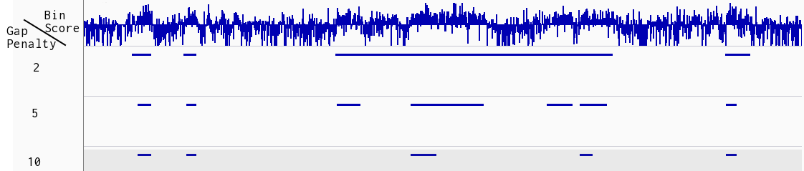

# EDD - Enriched Domain Detector

EDD is a ChIP-seq peak caller for detection of megabase domains of enrichment. 

## Installation Requirements
The most CPU intensive parts of the algorithm have been written in Cython, which will be translated into C and compiled during installation. A consequence of this is that EDD has compile time dependencies on the following python packages: Cython, numpy and pysam. So these packages must be installed prior to installing EDD.

```bash
pip install Cython numpy pysam
```

EDD also requires **R** to be installed.

## Installation

The latest stable version of EDD can be installed using pip

```bash
pip install edd
```

The latest development version of EDD can be installed by running the following command from the source folder after downloading or checking out a new version:
```bash
python setup.py install
```


## Usage
All the required and optional arguments to EDD are listed here and further explained below
```
edd [-h] [--bin-size BIN_SIZE] [-n NUM_TRIALS] [-p NPROCS] [--fdr FDR] [-s NEGATIVE_SCORE_SCALE] chrom_size gap_file ip_bam control_bam output_dir
```
### Required Arguments
* chrom_size:
  * This must be a tab separated file with two columns. 
  * The first column contains chromosome names and the second contains the chromosome sizes.
  * Instructions on how to acquire such a file can be found in the *Additional* section below.
* gap_file:
  * This must be a (possibly empty) bed file defining regions to be excluded from the analysis, such as telomeres, centromeres or other large repeat regions. 
  * Failure to include a proper gap file will increase the number of false positive domains detected in the analysis.
  * EDD will never detect a domain that spans a gap. 
  * Instructions on how to acquire such a file can be found in the *Additional* section below.
* ip_bam: a bam file containing aligned ChIP sequences
* input_bam: a bam file containing aligned Input sequences
* output_dir: a path to a directory, new or existing, that output files are stored in

### Optional Arguments
* --bin-size
 * Bin size is auto estimated if left blank (recommended), but can be overridden.
 * The argument must be an integer specifying the bin size in KB
* -n --num-trials
 * Number of monte carlo trials, by default 10,000
* -p --nprocs
 * Number of processes to use for monte carlo simulation, by default 4
 * Can be increased if your computer has many cores.
 * e.g. set this to 32 if you have 32 cores as this will reduce the running time.
* --fdr
 * Significance threshold for peak calling, by default 0.05
* -s --negative-score-scale, by default 6
 * Adjusts how sensitive EDD is to heterogeneity within domains. 
 * Depends on Signal/Noise ratio of source files and on the interests of the researcher. 
  * A lower value favors large enriched domains with more heterogeneity. 
  * A higher value favors smaller enriched domains devoid of heterogeneity.
  * More information and examples can be found in the *Additional* section below.

## Output Files
EDD creates three files in the output directory. 
* A bed file with peaks
* A log file describing input files, parameters and runtime data
* A bedgraph file with binscores

The peaks should always be compared against the bedgraph file in a genome browser. See the *Selecting a negative score scale parameter* example in the *Additional* section below.

## Additional

## Input Files
The ip and input bam files are expected to be of the approximate same
depth. EDD will perform a basic normalization by scaling input reads by a factor. 
This will not reflect biology if the difference between IP and Input
read depth is too large. It is therefore advisable to [downsample](http://picard.sourceforge.net/command-line-overview.shtml#DownsampleSam) the
experiment with the higher read count instead of scaling up the lesser
experiment by a factor. It is up to the researcher to decide when to
downsample instead of letting EDD perform this simple normalization.

### Obtain chromosome sizes
This can be extracted in various ways. For hg19, it is as simple as this (example borrowed from bedtools):
```bash
mysql --user=genome --host=genome-mysql.cse.ucsc.edu -A -e "select chrom, size from hg19.chromInfo" > hg19.genome
```

### Acquire a Gap file
The gap file is a bed file that identifies regions that should be excluded from the analysis. More precisely, no peak can ever span a gap region. Typical candidates for exclusion are broad spanning repeat regions such as centromeres and telomeres. Failure to include a proper gap file for an experiment will increase the number of false positives among the detected peaks. An example gap file for hg19 can be found at https://github.com/eivindgl/edd/blob/master/data/gap_hg19.bed

This has been downloaded from the UCSC table browser using [these options](http://genome.ucsc.edu/cgi-bin/hgTables?hgsid=359889977&clade=mammal&org=Human&db=hg19&hgta_group=map&hgta_track=gap&hgta_table=0&hgta_regionType=genome&position=chr21%3A33031597-33041570&hgta_outputType=primaryTable&hgta_outFileName=).

### Selecting a negative score scale parameter
The *negative score scale* (NSS) is a parameter that decides how hard EDD penalizes non-enriched bins within putative domains. The effect of this parameter is visualized below.



This example display an interesting region of a dataset analyzed with three different settings for the *negative score scale* parameter. The top track show the bin scores, that we visually evaluate the peak tracks against. We first notice that the detection of many domains are unaffected by changes to *NSS* (on both flanks). However, there is a larger domain in the middle that illustrates how domain detection is influenced by this parameter. 

* The track with a low NSS value (2) detects a single large domain in the middle. This domain spans some regions that are clearly depleted.
* The track with the middle NSS value (5) seem to detect the main trends and detected domains do not cross larger depleted regions.
* The last track with the high NSS value (10) only detects domains in homogenically enriched regions and it therefore misses some potentially interesting areas with slight heterogeneity.

We found the track with the middle NSS value to best represent the source data. It is, however, important to understand that none of the other two tracks are wrong or illegal. The best choice depends on interests and goals for further analysis.

It is also important to understand that what is a high and low NSS value depends on the source data analyzed. A rule of thumb is that "high quality" (good antibody, soluble protein etc) ChIP-seq experiments can tolerate a higher NSS value due to less noise and therefore less heterogeneity.
